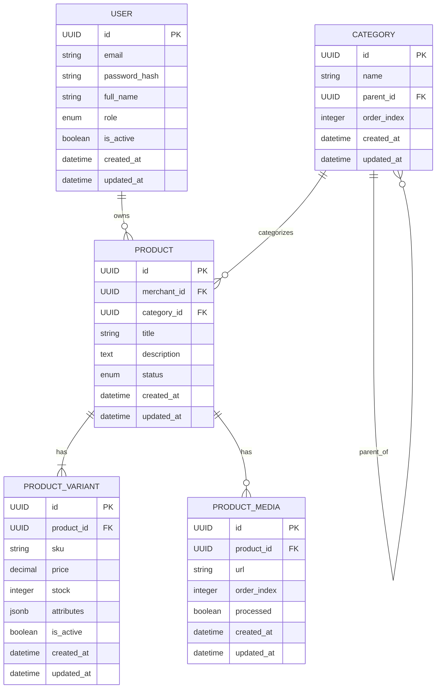

# SmartRetail Week 1 Design

## 1. Objective

The Week 1 backend provides a working authenticated CRUD API for the SmartRetail product domain.

The main domain objects are:

* User
* Category
* Product
* ProductVariant
* ProductMedia

The design separates HTTP handling, business logic, validation, database models, and security responsibilities.

---

## 2. Architecture

```text
Client
  ↓
FastAPI Router
  ↓
Pydantic Request Schema
  ↓
Service Layer
  ↓
SQLAlchemy ORM
  ↓
PostgreSQL
  ↓
Pydantic Response Schema
  ↓
Client
```

### API Layer

Location:

```text
app/api/v1/
```

Responsibilities:

* receive HTTP requests
* declare request/response schemas
* inject database/authentication dependencies
* call services
* return HTTP responses

Routers should not directly implement SQL queries or business rules.

### Service Layer

Location:

```text
app/services/
```

Responsibilities:

* business rules
* ownership checks
* database queries
* create/update/delete operations
* publishing validation
* filtering and listing logic

### Models

Location:

```text
app/models/
```

SQLAlchemy models describe database tables and relationships only.

### Schemas

Location:

```text
app/schemas/
```

Pydantic schemas define:

* request validation
* PATCH input
* safe API responses
* pagination structures

### Core

Location:

```text
app/core/
```

Contains cross-cutting infrastructure:

* configuration
* password hashing
* JWT handling
* authentication dependencies
* role authorization
* application exceptions

---

## 3. Entity Relationship Diagram



---

## 4. User Model

Each user has a role:

```text
customer
merchant
admin
```

Passwords are never stored directly.

```text
plaintext password
       ↓
bcrypt
       ↓
password_hash
       ↓
PostgreSQL
```

Public registration supports customer and merchant accounts.

Admin accounts are created or promoted separately.

---

## 5. Authentication

Login creates a signed JWT.

JWT claims include:

```text
sub
→ user UUID

role
→ role when token was issued

exp
→ expiration time
```

Protected requests send:

```text
Authorization: Bearer <JWT>
```

The backend does not rely solely on the JWT.

`get_current_user()` also loads the current user from PostgreSQL to confirm that the account:

* still exists
* is still active

---

## 6. Authorization

Authentication, role authorization, and ownership are separate checks.

```text
Request
  ↓
get_current_user()
  ↓
authenticated?
  ├── no → 401
  └── yes
       ↓
require_role(...)
       ↓
correct role?
  ├── no → 403
  └── yes
       ↓
ownership check
       ↓
owns resource?
  ├── no → 403
  └── yes → operation allowed
```

Admins may edit any product.

Merchants may only edit products where:

```text
product.merchant_id == current_user.id
```

---

## 7. Product and Variant Design

Stock belongs to `ProductVariant`, not `Product`.

Example:

```text
T-Shirt
├── SKU: SHIRT-BLACK-M
│   ├── price: 50
│   └── stock: 10
│
└── SKU: SHIRT-WHITE-L
    ├── price: 55
    └── stock: 3
```

This allows different stock and prices for different versions of the same product.

SKU values are globally unique.

Prices use:

```text
NUMERIC(10,2)
```

instead of floating-point types.

Variant attributes use PostgreSQL JSONB.

Example:

```json
{
  "color": "black",
  "size": "M"
}
```

---

## 8. Product Lifecycle

New products begin as:

```text
draft
```

Week 1 supports:

```text
draft
→ published
→ inactive
```

The model also contains statuses intended for later workflow-based publishing:

```text
publishing
publish_failed
```

Week 1 publishing is synchronous.

A later workflow implementation can replace the internal publishing logic while preserving the API endpoint.

---

## 9. Public Catalog Visibility

Anonymous visitors and customers only see products satisfying:

```text
status = published
AND
at least one active variant exists
AND
variant stock > 0
```

A merchant sees:

```text
all published products
+
their own products in any status
```

An admin sees all products.

---

## 10. Listing and Filtering

`GET /products` supports:

```text
category_id
min_price
max_price
in_stock
search
limit
offset
```

Price and stock filters operate on variants.

The service uses an SQL `EXISTS` condition instead of joining variants directly.

Conceptually:

```text
Show Product
IF EXISTS Variant
WHERE:
    variant.product_id = product.id
    AND variant matches requested filters
```

This avoids duplicate product rows when several variants match.

---

## 11. Pagination

Pagination uses:

```text
limit
offset
```

Example:

```text
limit = 20
offset = 40
```

means:

```text
skip first 40 matching products
return up to the next 20
```

Responses use:

```json
{
  "items": [],
  "total": 87,
  "limit": 20,
  "offset": 40
}
```

`total` is calculated before pagination is applied.

The maximum `limit` is 100.

---

## 12. Category Hierarchy

Categories support an optional `parent_id`.

Example:

```text
Electronics
├── Phones
├── Laptops
└── Accessories
```

The service validates that referenced parent categories exist.

A category cannot be its own parent.

---

## 13. Database Migrations

Database structure is managed through Alembic.

```text
SQLAlchemy models
       ↓
Base.metadata
       ↓
Alembic autogenerate
       ↓
migration revision
       ↓
alembic upgrade head
       ↓
PostgreSQL schema
```

The application does not use `Base.metadata.create_all()` as its schema-management mechanism.

---

## 14. Error Handling

Services raise application-specific exceptions such as:

```text
UnauthorizedError
ForbiddenError
NotFoundError
ConflictError
ValidationFailedError
```

FastAPI converts them to one response structure:

```json
{
  "error": {
    "code": "not_found",
    "message": "Product with id '...' was not found"
  }
}
```

Request validation errors are also converted to the common error format.

---

## 15. Testing

Testing is divided into:

```text
tests/unit/
→ isolated functions

tests/integration/
→ actual API behavior
```

Current results:

```text
23 tests passed
86% application coverage
```

Coverage exceeds the Week 1 requirement of 80%.

Integration tests validate:

* registration and login
* JWT authentication
* role authorization
* category CRUD
* product creation
* product ownership
* duplicate SKU rejection
* publishing
* public visibility
* stock filtering
* price filtering
* pagination
