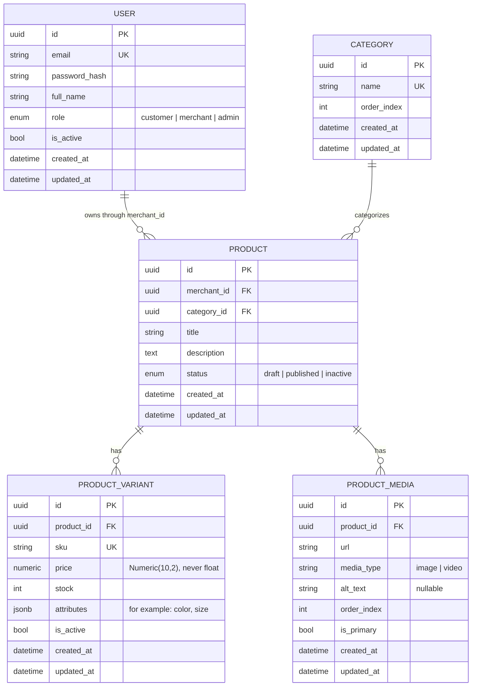

# Design — Week 1

## Entity-Relationship Diagram



## Entity Responsibilities

### User

The `USER` entity represents customers, merchants, and administrators.

A user's role controls which operations they may perform:

* `customer` users can browse published products.
* `merchant` users can create and manage products they own.
* `admin` users may perform administrative operations across the platform.

Passwords are never stored directly. Only a secure password hash is stored in `password_hash`.

The `email` field is unique because it is used as the user's login identity.

### Category

The `CATEGORY` entity groups products for catalog browsing and filtering.

Each product belongs to one category. Category names are unique so duplicate catalog categories are not created accidentally.

`order_index` controls the order in which categories are displayed.

Nested categories are not included in the Week 1 model. A self-referencing `parent_id` may be introduced later if hierarchical categories become a confirmed requirement.

### Product

The `PRODUCT` entity represents the general catalog item.

Examples include:

* Cotton T-shirt
* Wireless headphones
* Running shoes

A product belongs to:

* one merchant through `merchant_id`
* one category through `category_id`

The product does not store its own price or inventory quantity. Those values belong to its variants.

The Week 1 product statuses are:

* `draft` — still being prepared and not visible publicly
* `published` — visible to customers
* `inactive` — no longer available for normal catalog browsing

Week 2 may add workflow-related states such as `publishing` and `publish_failed` through a new migration.

### ProductVariant

The `PRODUCT_VARIANT` entity represents a specific sellable version of a product.

For example, the product:

```text
Cotton T-shirt
```

may have variants such as:

```text
Red / Medium
Red / Large
Blue / Medium
```

Inventory and price belong to the variant because each sellable variation may have a different price and stock quantity.

Important rules:

* `sku` must be unique.
* `price` must be greater than zero.
* `stock` must be zero or greater.
* inactive variants are not available for purchase.

The `attributes` JSONB field stores flexible characteristics such as:

```json
{
  "color": "red",
  "size": "M"
}
```

This avoids adding a new database column for every possible product-specific property.

### ProductMedia

The `PRODUCT_MEDIA` entity stores images or videos attached to a product.

It includes:

* the media URL
* the media type
* accessibility alternative text
* the display order
* whether the media item is the primary product image

A product can have multiple media records.

## Inventory Placement

Inventory lives on `PRODUCT_VARIANT`, never on `PRODUCT`.

A general product such as a T-shirt is not directly purchasable. The customer purchases a specific variant such as:

```text
Red / Medium
```

Each variant has its own stock quantity.

This design is also required for Week 2's concurrency-safe inventory update. The reservation logic will operate on one variant using an atomic statement similar to:

```sql
UPDATE product_variants
SET stock = stock - :quantity
WHERE id = :variant_id
  AND stock >= :quantity;
```

The `stock >= :quantity` condition prevents the stock value from becoming negative when multiple orders attempt to reserve the final units concurrently.

## Relationships

The Week 1 relationships are:

* One merchant user can own many products.
* Each product belongs to one merchant.
* One category can contain many products.
* Each product belongs to one category.
* One product can have many variants.
* Each variant belongs to one product.
* One product can have many media records.
* Each media record belongs to one product.

## Deletion Behavior

Deleting a product should also delete its related:

* product variants
* product media records

This is a cascade-delete relationship because variants and media cannot exist meaningfully without their parent product.

Users should generally be deactivated using `is_active = false` instead of being physically deleted. This avoids accidentally removing merchant ownership records and preserves audit history.

Categories should not be deleted while products still reference them unless those products are moved to another category first.

## Timestamps

Every table includes:

* `created_at`
* `updated_at`

Both values must use timezone-aware UTC timestamps.

Naive local datetimes should not be stored because the backend may later run across different servers, regions, or time zones.

## Public Product Visibility

Anonymous users and customers should only see products that satisfy all of the following:

* the product status is `published`
* at least one variant is active
* at least one active variant has stock greater than zero

Merchants may view their own products even when they are:

* drafts
* inactive
* out of stock

Administrators may view all products.

The visibility logic belongs in the service layer rather than directly inside router functions.

## Ownership and Role Checks

Role authorization and resource ownership are separate checks.

A role check answers:

> Is this user allowed to use merchant functionality?

An ownership check answers:

> Does this merchant own this specific product?

For example:

* A customer calling a merchant-only endpoint receives `403 Forbidden`.
* A merchant editing another merchant's product also receives `403 Forbidden`.
* An administrator may be allowed to edit products regardless of ownership, depending on the endpoint.

Combining role and ownership into one check could accidentally allow one merchant to edit a competitor's products.

## Module Breakdown

### `app/core/`

Contains application-wide concerns that are not specific to products, users, or orders.

Examples include:

* environment settings
* JWT and password-hashing helpers
* authentication dependencies
* authorization dependencies
* application exceptions
* logging
* metrics

Database connection code does not belong here.

### `app/db/`

Contains SQLAlchemy database infrastructure.

Current files include:

* `base.py` — defines the declarative `Base` inherited by ORM models
* `session.py` — defines the engine, session factory, and `get_db`

The database layer knows how to connect to PostgreSQL, but it does not contain product or authentication business rules.

### `app/models/`

Contains SQLAlchemy ORM model classes.

Each model describes database table shape, including:

* columns
* constraints
* foreign keys
* ORM relationships

Models should not contain HTTP handling or complex business rules.

### `app/schemas/`

Contains Pydantic request and response models.

Schemas should be separated by purpose, such as:

* `ProductCreate`
* `ProductUpdate`
* `ProductOut`
* `UserRegister`
* `UserLogin`
* `UserOut`

Response schemas structurally prevent internal fields such as `password_hash` from being returned to clients.

### `app/services/`

Contains the application's business logic.

Service functions:

* receive a SQLAlchemy `Session`
* receive schemas or plain Python arguments
* apply business rules
* query or update database models
* return models or raise application exceptions

Services should not use FastAPI's `Depends` or import HTTP request objects.

Keeping the service layer independent from FastAPI allows business behavior to be unit-tested without starting the HTTP layer.

### `app/api/v1/`

Contains version 1 FastAPI routers.

Routers are thin translation layers that:

* receive HTTP requests
* let FastAPI and Pydantic validate input
* receive dependencies such as the database session and current user
* call service functions
* return responses using declared response models

A router should not contain SQL queries or substantial business logic.

If a router function becomes long or starts checking ownership, stock, publishing rules, or database constraints directly, that logic should be moved into a service.

## Key Decisions and Tradeoffs

### UUID Primary Keys

UUIDs are used instead of auto-incrementing integers.

Benefits:

* identifiers are difficult to guess
* IDs do not expose the approximate number of records
* IDs can be generated independently across distributed services

Tradeoffs:

* UUID indexes are larger than integer indexes
* UUID values are less readable during manual debugging
* UUIDs do not provide a natural insertion order

When chronological order matters, records should be explicitly sorted by `created_at`.

### Numeric Prices Instead of Floating-Point Prices

Variant prices use:

```text
Numeric(10,2)
```

rather than floating-point values.

Floating-point numbers may produce precision errors when representing decimal money values.

Database numeric types and Python `Decimal` values provide predictable price calculations.

### JSONB Variant Attributes

Variant-specific characteristics are stored in a JSONB column.

A T-shirt might use:

```json
{
  "color": "blue",
  "size": "L"
}
```

A book might use:

```json
{
  "format": "hardcover",
  "edition": "second"
}
```

Benefits:

* supports different product types
* avoids frequent schema migrations
* allows flexible merchant-defined attributes

Tradeoffs:

* attribute types are not strongly constrained by fixed database columns
* filtering arbitrary attributes may require more complex queries and indexes
* validation must primarily happen through Pydantic and service logic

### Domain Exceptions

Service functions raise application-specific exceptions rather than FastAPI `HTTPException`.

Examples include:

* `NotFoundError`
* `ForbiddenError`
* `ConflictError`
* `ValidationFailedError`
* `UnauthorizedError`

These exceptions inherit from a common `AppError` base class.

A centralized exception handler in `main.py` converts them into one consistent JSON structure:

```json
{
  "error_code": "product_not_found",
  "message": "Product was not found"
}
```

Benefits:

* error responses remain consistent
* services remain independent from FastAPI
* routers do not need repeated `try` and `except` blocks

Tradeoff:

* developers must trace errors through the exception handler while debugging

The exception hierarchy should therefore remain small and clearly documented.

### Synchronous Publishing in Week 1

In Week 1, publishing is implemented synchronously.

The router calls a product service that:

1. checks that the current user may edit the product
2. validates the product
3. collects all validation errors
4. changes the product status to `published`
5. commits the database transaction

Validation includes:

* title is required
* description is required
* at least one variant exists
* every variant has a price greater than zero
* every variant has stock greater than or equal to zero

This logic belongs in `product_service`, not in the router.

The endpoint contract remains:

```text
POST /products/{product_id}/publish
```

This allows Week 2 to replace the internal implementation with a Temporal workflow without unnecessarily changing how clients call the endpoint.

### Pagination Limit

Product listing uses:

```text
limit
offset
```

The default limit is 20 and the maximum allowed limit is 100.

Without a server-side maximum, a client could request a very large limit and force the backend to query and serialize the entire product table in one request.

Paginated responses include:

```json
{
  "items": [],
  "total": 0,
  "limit": 20,
  "offset": 0
}
```

Returning `total` allows clients to calculate how many pages exist.

## What Week 2 Changes

Week 2 introduces durable workflows and concurrency-safe order processing.

Expected data-model and behavior changes include:

* adding workflow-related product statuses such as `publishing` and `publish_failed`
* changing the publish operation from a synchronous status update to a Temporal workflow
* returning `202 Accepted` when the publish workflow starts
* returning a workflow identifier
* adding a publish-status endpoint
* preventing illegal status transitions
* adding inventory reservation records
* adding order, payment, and shipment entities
* implementing atomic stock reservation against `ProductVariant`
* implementing compensation actions when later workflow steps fail

A future `content_chunks` table may be introduced when the publishing workflow prepares product text for the retrieval and AI layers.

## Week 1 Design Summary

The Week 1 model follows these core rules:

* inventory belongs to product variants
* merchants own products
* role and ownership checks are separate
* prices use fixed-precision numeric storage
* every table uses timezone-aware UTC timestamps
* routers stay thin
* services contain business logic
* models describe database structure
* schemas control request and response data
* Alembic manages schema creation and changes
* ORM objects are never returned without response-schema filtering
