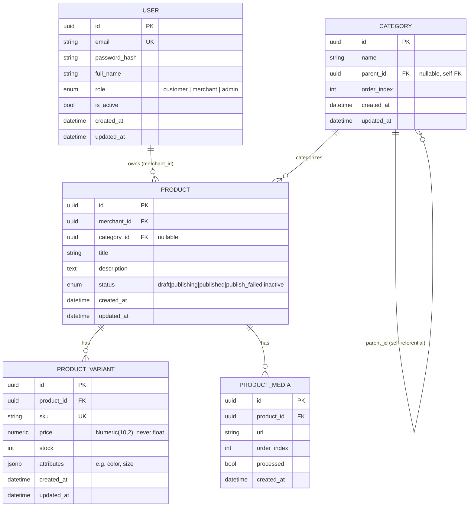

# Design — Week 1

## Entity-Relationship Diagram

Inventory (`stock`) lives on `PRODUCT_VARIANT`, never on `PRODUCT` — a
product like "T-shirt" isn't purchasable by itself, only a specific
variant ("red, M") is. This is also what Week 2's concurrency-safe
reservation (`UPDATE product_variants SET stock = stock - :qty WHERE id
= :id AND stock >= :qty`) will run against.

## Module breakdown

- **`app/core/`** — cross-cutting concerns with no knowledge of
  products/orders/users as *business* concepts: settings, the DB
  session factory, JWT/bcrypt primitives, the domain exception
  hierarchy, and the two auth dependencies (`get_current_user`,
  `require_role`).
- **`app/models/`** — one file per table. Pure SQLAlchemy — no
  validation logic, no business rules.
- **`app/schemas/`** — one file per resource, split into `*Create` /
  `*Update` / `*Out` classes. `*Out` schemas are what guarantee
  `password_hash` (and anything else internal) can never leak into a
  response, structurally, not by convention.
- **`app/services/`** — all business logic. Every function takes a
  `Session` and plain arguments, returns a model or raises an
  `AppError` subclass. No FastAPI imports anywhere in this folder —
  that's what makes ownership/role/validation logic unit-testable
  without spinning up the HTTP layer (see
  `test_publish_rejects_product_with_no_variants`, which calls
  `set_product_status` directly).
- **`app/api/`** — routers. Each function is a thin translation layer:
  FastAPI parses the request into a schema, the router calls exactly
  one service function, `response_model=` shapes the output. If a
  router function is doing anything more complex than that, business
  logic has leaked into it (the thing execution guidelines §5.2 warns
  against).

## Key decisions and tradeoffs

**UUID primary keys vs. auto-increment integers.** UUIDs don't leak
row counts or let anyone guess adjacent records by incrementing a URL.
Tradeoff: slightly larger index size and no natural insertion-order
sort (we sort by `created_at` explicitly where order matters).

**Ownership and role checked as two separate conditions
(`_assert_can_edit`).** A customer calling a merchant endpoint is a
role failure; a merchant editing someone else's product is an
ownership failure. Conflating "is a merchant" with "owns this
resource" is exactly how a merchant ends up able to edit competitors'
listings — recognized explicitly in the spec's list of common mistakes.

**Domain exceptions instead of raising `HTTPException` from
`services/`.** Every service function raises a plain Python exception
(`NotFoundError`, `ForbiddenError`, `ConflictError`,
`ValidationFailedError`, `UnauthorizedError` — all `AppError`
subclasses carrying their own HTTP status). `main.py` has exactly one
handler that converts any `AppError` into the same JSON shape. Benefit:
the error shape can't drift between endpoints because there's only one
place it's constructed. Cost: one extra layer of indirection to trace
through when debugging — mitigated by keeping the hierarchy small (5
subclasses) and the mapping obvious (status_code is a class attribute).

**Publishing is a synchronous status flip in Week 1, not yet a
workflow.** The spec's real publish flow (validate → process media →
build catalog records → chunk text → PUBLISHED) is a Temporal workflow
starting in Week 2. Doing the naive version first, behind the same
`POST /products/{id}/publish` contract, means Week 2 changes what's
*inside* the endpoint (kick off a workflow, return 202) without any
client-facing contract change. The validation rules themselves
(title/description required, ≥1 variant, price>0, stock≥0, "return all
errors at once") are implemented now and will move into the workflow's
first Activity unchanged.

**JSONB `attributes` on variants instead of fixed columns.** A T-shirt
variant needs `color`/`size`; a book variant needs neither and might
need `edition`. A flexible JSONB column avoids a schema migration every
time a merchant lists a new kind of product, at the cost of losing
DB-level type constraints on those fields (validated at the Pydantic
layer instead, on the way in).

**Pagination cap enforced server-side (`limit`, max 100).** Without a
hard cap, a client requesting `limit=1000000` could force one request
to scan and serialize the whole table. `total` is always returned
alongside `items` so the client can compute how many pages exist.

## What Week 2 changes here

- `ProductStatus.PUBLISHING` / `PUBLISH_FAILED` become reachable states,
  driven by a Temporal workflow instead of a direct status write.
- `POST /products/{id}/publish` returns `202 Accepted` with a workflow
  id instead of the finished resource; a new `GET
  /products/{id}/publish-status` reports progress.
- A `content_chunks` table is added — the publish workflow's last step
  populates it, and it's what Part B's retrieval layer reads from.
- Illegal status transitions (e.g. publishing an already-PUBLISHING
  product) start returning `409` from one central check before the
  workflow starts.
